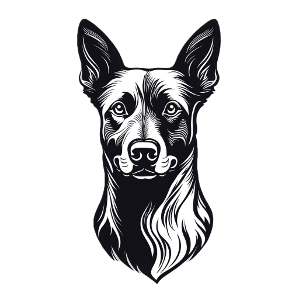
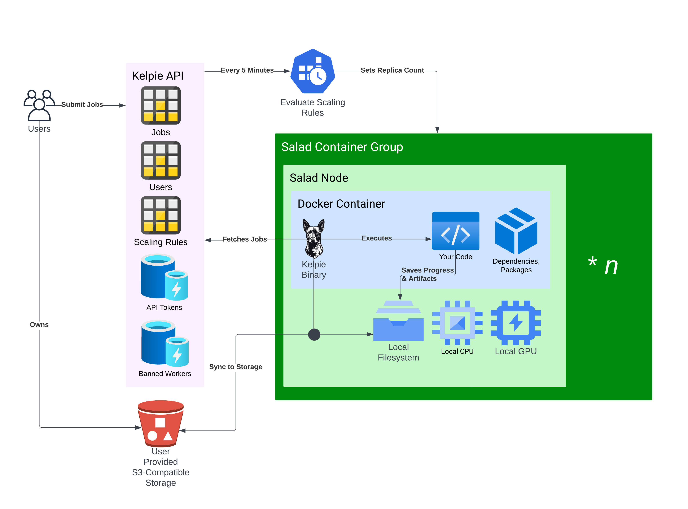

# 🐕 Kelpie (beta)



Kelpie shepherds long-running jobs through to completion on interruptible hardware, coordinating with the [Kelpie API](https://github.com/SaladTechnologies/kelpie-api)

- [🐕 Kelpie (beta)](#-kelpie-beta)
  - [Who is it for?](#who-is-it-for)
  - [What it is](#what-it-is)
  - [How it Works](#how-it-works)
  - [Adding the kelpie Worker To Your Container Image](#adding-the-kelpie-worker-to-your-container-image)
  - [Environment Variables](#environment-variables)
  - [Deploying Your Container Group](#deploying-your-container-group)
  - [What it DOES NOT do](#what-it-does-not-do)
  - [API Authorization](#api-authorization)
    - [Base URL](#base-url)
    - [Salad API Key](#salad-api-key)
    - [Salad Instance Metadata Service (IMDS) JWT](#salad-instance-metadata-service-imds-jwt)
    - [LEGACY: Kelpie API Key](#legacy-kelpie-api-key)
    - [Priority of Authorization](#priority-of-authorization)
  - [Queueing a job](#queueing-a-job)
    - [`POST /jobs`](#post-jobs)
    - [`POST /jobs/batch`](#post-jobsbatch)
  - [Canceling a job](#canceling-a-job)
    - [`DELETE /jobs/:id`](#delete-jobsid)
  - [Checking on a job](#checking-on-a-job)
    - [`GET /jobs/:id`](#get-jobsid)
  - [Listing Your Jobs](#listing-your-jobs)
    - [`GET /jobs`](#get-jobs)
  - [Autoscaling Configuration](#autoscaling-configuration)
    - [`POST /scaling-rules`](#post-scaling-rules)
  - [Job Lifecycle](#job-lifecycle)
  - [Understanding Job Status](#understanding-job-status)
  - [Status Webhooks](#status-webhooks)
    - [Webhook Authorization](#webhook-authorization)

## Who is it for?

Kelpie is for anyone who wants to run long running compute-intensive jobs on [Salad](https://salad.com/), the world's largest distributed GPU cloud.
Whether that's [LoRA training](https://blog.salad.com/cost-effective-stable-diffusion-fine-tuning-on-salad/), Monte Carlo simulations, Molecular Dynamics simulations, or anything else, Kelpie can help you run your jobs to completion, even if they take days or weeks.
You bring your own docker container that contains your script and dependencies, add the Kelpie binary to it, and deploy.

If you'd like to join the Kelpie beta, and are an existing Salad customer, just reach out to your point of contact via email, discord, or slack.
If you're interested in Kelpie and are new to Salad, reach out to support at [cloud@salad.com](cloud@salad.com), and mention you're interested in using Kelpie.

## What it is

Kelpie is a job queue that is particularly focused on the challenges of running extremely long tasks on interruptible hardware. It is designed to be simple to instrument, and to be able to integrate with any containerized workload.
It executes scripts in a container according to a job definition, and *optionally* handles downloading input data, uploading output data, and syncing progress checkpoints to your s3-compatible storage.
It also provides a mechanism for scaling your container group in response to job volume.

## How it Works



Kelpie is a standalone binary that runs in your container image.
It coordinates with the Kelpie API to download your input data, upload your output data, and sync progress checkpoints to your s3-compatible storage.
You submit jobs to the [Kelpie API](https://kelpie.saladexamples.com/docs), and those jobs get assigned to salad worker nodes that have the Kelpie binary installed.

If you define [scaling rules](https://kelpie.saladexamples.com/docs#/default/post_CreateScalingRule), the Kelpie API will handle starting and stopping your container group, and scaling it up and down in response to job volume.

When a job is assigned to a worker, the worker downloads your input data, and your checkpoint, and runs your command with the provided arguments and environment variables. When files are added to a directory defined in your job definition, Kelpie uploads that file to the bucket and prefix you've defined. When your command exits successfully, the output directory you defined is uploaded to your storage, the job is marked as complete, and a webhook is sent to the url you've provided, if any.

## Adding the kelpie Worker To Your Container Image

```dockerfile
# Start with a base image that has the dependencies you need,
# and can successfully run your script.
FROM yourimage:yourtag

# Add the kelpie binary to your container image
ARG KELPIE_VERSION=0.6.0
ADD https://github.com/SaladTechnologies/kelpie/releases/download/${KELPIE_VERSION}/kelpie /kelpie
RUN chmod +x /kelpie

# Use kelpie as the "main" command. Kelpie will then execute your
# command with the provided arguments and environment variables
# from the job definition.
CMD ["/kelpie"]
```

When running the image, you will need additional configuration in the environment:

- Exactly one of the [supported authentication methods.](#api-authorization)
- If using Kelpie for state management, AWS/Cloudflare Credentials: Provide `AWS_ACCESS_KEY_ID`, etc to enable the kelpie worker to upload and download from your bucket storage. We use the s3 compatibility api, so any s3-compatible storage should work. We recommend using [Cloudflare R2](https://www.cloudflare.com/products/r2/) for this, as it has no egress fees.

Additionally, your script must support the following things:

- Saving and Resuming From Checkpoints: Your script should periodically output progress checkpoints, so the job can be resumed with minimal loss in the case of interruption.
- It must exit "successfully" with an exit code of 0 upon completion
- It must exit with a non-zero exit code if it fails, so that Kelpie can mark the job as failed and retry it if necessary.

Upload your docker image to the container registry of your choice. Salad supports public and private registries, including Docker Hub, AWS ECR, and GitHub Container Registry, among others.

## Environment Variables

| Variable                     | Description                                                                                                                                                                                                               | Default Value                      | Required |
| ---------------------------- | ------------------------------------------------------------------------------------------------------------------------------------------------------------------------------------------------------------------------- | ---------------------------------- | -------- |
| KELPIE_API_URL               | The URL for the Kelpie API                                                                                                                                                                                                | `https://kelpie.saladexamples.com` | no       |
| KELPIE_API_KEY               | The API key for authenticating with the Kelpie API                                                                                                                                                                        | None                               | No       |
| SALAD_API_KEY                | The API key for authenticating with the Salad API and the Kelpie API.                                                                                                                                                     | None                               | No       |
| SALAD_MACHINE_ID             | The ID of the Salad machine                                                                                                                                                                                               | *set dynamically by Salad*         | No       |
| SALAD_CONTAINER_GROUP_ID     | The ID of the Salad container group                                                                                                                                                                                       | *set dynamically by Salad*         | No       |
| SALAD_ORGANIZATION           | The name of your Salad organization. This can be determined automatically when running on a Salad Node, or can be set manually for testing purposes.                                                                      | *set dynamically by Salad*         | No       |
| SALAD_PROJECT                | The name of your Salad project. Must be set if using Salad API Key, or relying on IMDS JWT for authentication.                                                                                                            | None                               | No       |
| MAX_RETRIES                  | The maximum number of retries for API operations                                                                                                                                                                          | "3"                                | No       |
| MAX_JOB_FAILURES             | The maximum number of job failures allowed before an instance should reallocate.                                                                                                                                          | "3"                                | No       |
| MAX_TIME_WITH_NO_WORK_S      | The maximum time to wait for work before exiting. May be exceeded by up to 10 seconds (1 heartbeat interval)                                                                                                              | "0" (Never)                        | No       |
| KELPIE_LOG_LEVEL             | The log level for kelpie                                                                                                                                                                                                  | "info"                             | No       |
| KELPIE_RECREATE_BETWEEN_JOBS | Whether to recreate the environment between jobs, by deleting and recreating the container. This is useful for ensuring a clean environment, but may increase job startup time, and lead to idle GPU time during uploads. | "false"                            | No       |

Additionally, Kelpie will respect AWS environment variables, such as `AWS_ACCESS_KEY_ID`, `AWS_SECRET_ACCESS_KEY`, etc. These are used to authenticate with your s3-compatible storage.

## Deploying Your Container Group

You can deploy your container group using the [Salad API](https://docs.salad.com/api-reference/container_groups/create-a-container-group), or via the [Salad Portal](https://portal.salad.com/).
You will need to add the kelpie salad user (currently <shawn.rushefsky@salad.com>) to your organization to enable the scaling features of kelpie.
This is optional, and only required if you want to use Kelpie's autoscaling features.
Kelpie uses the Salad API to [start](https://docs.salad.com/reference/saladcloud-api/container_groups/start-a-container-group), [stop](https://docs.salad.com/reference/saladcloud-api/container_groups/stop-a-container-group), and [scale](https://docs.salad.com/reference/saladcloud-api/container_groups/update-a-container-group) your container group in response to job volume.

In your container group configuration, you will provide the docker image url, the hardware configuration needed by your job, and the environment variables detailed above.
You do not need to enable Container Gateway, or Job Queues, and you do not need to configure probes.
While Salad does offer built-in logging, it is still recommended to connect an [external logging service](https://docs.salad.com/products/sce/container-groups/external-logging/external-logging) for more advanced features.

Once your container group is deployed, and you've verified that the node starts and runs successfully, you'll want to retrieve the container group ID from the [Salad API](https://docs.salad.com/api-reference/container_groups/get-a-container-group). You will use this ID when submitting jobs to the Kelpie API.

## What it DOES NOT do

1. kelpie does not store your data on our servers or in our storage buckets, beyond the job definition you submit. It merely facilitates syncing your data from local node storage to your preferred s3-compatible storage.
2. kelpie does not monitor the ongoing progress of your job, beyond ensuring it eventually exits successfully. You should integrate your own monitoring solution, e.g. [Weights and Balances](https://wandb.ai/)
3. kelpie does not containerize your job for you. It provides a binary that can be added to existing containerized jobs.
4. kelpie does not create or delete your container groups. If configured with scaling rules, kelpie can start, stop, and scale your container group in response to job volume.

## API Authorization

There are [live swagger docs](https://kelpie.saladexamples.com/docs) that should be considered more accurate and up to date than this readme.

### Base URL

All API requests should use a base url of `https://kelpie.saladexamples.com`.

### Salad API Key

You will use your Salad API Key in the `Salad-Api-Key` header for all requests to the Kelpie API. This is used to authenticate you as a Salad user, and to authorize you to use the Kelpie API. A kelpie user object is created for each organization that authenticates this way.

When using this key, you must also include two additional headers:

- `Salad-Organization`: The name of the Salad organization you are using
- `Salad-Project`: The name of the Salad project you are using

Many Kelpie operations are specific to a Salad organization and project, so these headers are required for all requests.

### Salad Instance Metadata Service (IMDS) JWT

Kelpie workers will use a JWT issued by the Salad Instance Metadata Service (IMDS) to authenticate themselves to the Kelpie API. This JWT is automatically provided by the Salad Container Group when the worker is running inside a Salad Container Group. This JWT is included in the `Authorization` header of all requests made by the Kelpie worker to the Kelpie API as a Bearer token. A kelpie user object is created for each organization that authenticates this way.

Kelpie will also include the required `Salad-Project` header, using a value found in the environment variable `SALAD_PROJECT` set by you when configuring your container group.

### LEGACY: Kelpie API Key

Your kelpie api key is used by you to submit work, and also by kelpie workers to pull and process work. Kelpie API keys are scoped to a specific Salad organization and project, and are used to authenticate requests to the Kelpie API.

All requests to the Kelpie API must include the header:

`X-Kelpie-Key: myapikey`

And you must include `KELPIE_API_KEY` in your environment variables when running the kelpie worker.

### Priority of Authorization

The kelpie worker looks for the following authorization methods, in order:

1. **LEGACY** `KELPIE_API_KEY` environment variable
2. `SALAD_API_KEY` environment variable, plus `SALAD_ORGANIZATION` and `SALAD_PROJECT` environment variables. Can derive organization from the IMDS JWT if running on a Salad Node.
3. IMDS JWT and `SALAD_PROJECT` environment variable.

## Queueing a job

Queueing a job for processing is a post request to the Kelpie API.

This request will create a job in the Kelpie API, which will then be picked up by a Kelpie worker running on a Salad Container Group.

A Kelpie job definition consists of the following fields:

- `container_group_id`: The ID of the container group to run the job in. This works effectively as a queue id, with kelpie workers being able to automatically determine which jobs to run based on the container group they are running in. This is useful for ensuring that jobs are only run on the correct container group.
- `command`: The command to run in the container. This is the main entrypoint for your job.
- `arguments`: An array of arguments to pass to the command. This is passed as a list of strings.
- `environment`: An object containing environment variables to set for the job. The parent environment of the container is also passed to the job, with this block taking precedence in the event of a conflict.
- `sync`: An object containing the sync configuration for the job. This is used to download and upload files to/from your bucket storage.
  - `before`: An array of objects specifying files to download before the job starts. Each object should contain:
    - `bucket`: The name of the bucket to download from.
    - `prefix`: The prefix of the files to download.
    - `local_path`: The local path to download the files to.
    - `direction`: Should be "download".
  - `during`: An array of objects specifying files to upload during the job. Each object should contain:
    - `bucket`: The name of the bucket to upload to.
    - `prefix`: The prefix of the files to upload.
    - `local_path`: The local path to upload the files from.
    - `direction`: Should be "upload".
  - `after`: An array of objects specifying files to upload after the job completes. Each object should contain:
    - `bucket`: The name of the bucket to upload to.
    - `prefix`: The prefix of the files to upload.
    - `local_path`: The local path to upload the files from.
    - `direction`: Should be "upload".
- `webhook`: An optional URL to send a webhook to when the job starts, completes, or fails. This is useful for monitoring the status of your job.

### `POST /jobs`

**Request Body**

```json
{
  "command": "python",
  "arguments": [
    "/path/to/main.py",
    "--arg",
    "value"
  ],
  "environment": { "SOME_VAR": "string"},
  "sync": {
    "before": [
      {
        "bucket": "my-bucket",
        "prefix": "inputs/job1/",
        "local_path": "inputs/",
        "direction": "download"
      },
      {
        "bucket": "my-bucket",
        "prefix": "checkpoints/job1/",
        "local_path": "checkpoints/",
        "direction": "download"
      }
    ],
    "during": [
      {
        "bucket": "my-bucket",
        "prefix": "checkpoints/job1/",
        "local_path": "checkpoints/",
        "direction": "upload"
      }
    ],
    "after": [
      {
        "bucket": "my-bucket",
        "prefix": "outputs/job1/",
        "local_path": "outputs/",
        "direction": "upload"
      },

    ]
 },
  "webhook": "https://myapi.com/kelpie-webhooks",
  "container_group_id": "97f504e8-6de6-4322-b5d5-1777a59a7ad3"
}
```

**Response Body**

```json
{
  "id": "8b9c902c-7da6-4af3-be0b-59cd4487895a",
  "user_id": "your-user-id",
  "status": "pending",
  "created": "2024-04-19T18:53:31.000Z",
  "started": null,
  "completed": null,
  "canceled": null,
  "failed": null,
  "command": "python",
  "arguments": [
    "/path/to/main.py",
    "--arg",
    "value"
  ],
  "environment": { "SOME_VAR": "string"},
  "sync": {
    "before": [
      {
        "bucket": "my-bucket",
        "prefix": "inputs/job1/",
        "local_path": "inputs/",
        "direction": "download"
      },
      {
        "bucket": "my-bucket",
        "prefix": "checkpoints/job1/",
        "local_path": "checkpoints/",
        "direction": "download"
      }
    ],
    "during": [
      {
        "bucket": "my-bucket",
        "prefix": "checkpoints/job1/",
        "local_path": "checkpoints/",
        "direction": "upload"
      }
    ],
    "after": [
      {
        "bucket": "my-bucket",
        "prefix": "outputs/job1/",
        "local_path": "outputs/",
        "direction": "upload"
      }
    ]
  },
  "webhook": "https://myapi.com/kelpie-webhooks",
  "heartbeat": null,
  "num_failures": 0,
  "container_group_id": "97f504e8-6de6-4322-b5d5-1777a59a7ad3",
  "machine_id": null
}
```

### `POST /jobs/batch`

You can submit up to 1000 jobs at a time using the `/jobs/batch` endpoint. This is useful for bulk job submission.

**Request Body**

The request body is an array of job definitions, similar to the single job submission above. Each job definition should have the same structure as the single job submission.

```json
[
  {
    "command": "python",
    "arguments": [
      "/path/to/main.py",
      "--arg",
      "value"
    ],
    "environment": { "SOME_VAR": "string"},
    "sync": {
      "before": [
        {
          "bucket": "my-bucket",
          "prefix": "inputs/job1/",
          "local_path": "inputs/",
          "direction": "download"
        },
        {
          "bucket": "my-bucket",
          "prefix": "checkpoints/job1/",
          "local_path": "checkpoints/",
          "direction": "download"
        }
      ],
      "during": [
        {
          "bucket": "my-bucket",
          "prefix": "checkpoints/job1/",
          "local_path": "checkpoints/",
          "direction": "upload"
        }
      ],
      "after": [
        {
          "bucket": "my-bucket",
          "prefix": "outputs/job1/",
          "local_path": "outputs/",
          "direction": "upload"
        }
      ]
    },
    "webhook": null,
    "container_group_id": null
  }
]
```

**Response Body**

The response body is an array of job definitions, similar to the single job submission response. Each job definition will have an `id` field added, which is the unique identifier for the job.

```json
[
  {
    "id": "8b9c902c-7da6-4af3-be0b-59cd4487895a",
    "user_id": "your-user-id",
    "status": "pending",
    "created": "2024-04-19T18:53:31.000Z",
    "started": null,
    "completed": null,
    "canceled": null,
    "failed": null,
    "command": "python",
    "arguments": [
      "/path/to/main.py",
      "--arg",
      "value"
    ],
    "environment": { "SOME_VAR": "string"},
    "sync": {
      "before": [
        {
          "bucket": "my-bucket",
          "prefix": "inputs/job1/",
          "local_path": "inputs/",
          "direction": "download"
        },
        {
          "bucket": "my-bucket",
          "prefix": "checkpoints/job1/",
          "local_path": "checkpoints/",
          "direction": "download"
        }
      ],
      "during": [
        {
          "bucket": "my-bucket",
          "prefix": "checkpoints/job1/",
          "local_path": "checkpoints/",
          "direction": "upload"
        }
      ],
      "after": [
        {
          "bucket": "my-bucket",
          "prefix": "outputs/job1/",
          "local_path": "outputs/",
          "direction": "upload"
        }
      ]
    },
    "webhook": null,
    "heartbeat": null,
    "num_failures": 0,
    "container_group_id": null,
    "machine_id": null
  }
]
```

## Canceling a job

You can cancel a job using the job id

### `DELETE /jobs/:id`

**Response Body**

```json
{
  "message": "Job canceled"
}
```

## Checking on a job

As mentioned above, Kelpie does not monitor the progress of your job, but it does track the status (pending, running, canceled, completed, failed). You can get a job using the job id:

### `GET /jobs/:id`

**Response Body**

```json
{
  "id": "8b9c902c-7da6-4af3-be0b-59cd4487895a",
  "user_id": "your-user-id",
  "status": "pending",
  "created": "2024-04-19T18:53:31.000Z",
  "started": null,
  "completed": null,
  "canceled": null,
  "failed": null,
  "command": "python",
  "arguments": [
    "/path/to/main.py",
    "--arg",
    "value"
  ],
  "environment": { "SOME_VAR": "string"},
  "sync": {
    "before": [
      {
        "bucket": "my-bucket",
        "prefix": "inputs/job1/",
        "local_path": "inputs/",
        "direction": "download"
      },
      {
        "bucket": "my-bucket",
        "prefix": "checkpoints/job1/",
        "local_path": "checkpoints/",
        "direction": "download"
      }
    ],
    "during": [
      {
        "bucket": "my-bucket",
        "prefix": "checkpoints/job1/",
        "local_path": "checkpoints/",
        "direction": "upload"
      }
    ],
    "after": [
      {
        "bucket": "my-bucket",
        "prefix": "outputs/job1/",
        "local_path": "outputs/",
        "direction": "upload"
      }
    ]
  },
  "webhook": "https://myapi.com/kelpie-webhooks",
  "heartbeat": null,
  "num_failures": 0,
  "container_group_id": "97f504e8-6de6-4322-b5d5-1777a59a7ad3",
  "machine_id": null
}
```

## Listing Your Jobs

Get your jobs in bulk.

### `GET /jobs`

**Query Parameters**

All query parameters for this endpoint are optional.

| name               | description                                            | default |
| ------------------ | ------------------------------------------------------ | ------- |
| status             | pending, running, completed, canceled, failed          | *none*  |
| container_group_id | query only jobs assigned to a specific container group | *none*  |
| page_size          | How many jobs to return per page                       | 100     |
| page               | Which page of jobs to query                            | 1       |
| asc                | Boolean. Sort by `created`, ascending                  | false   |

**Response Body**

```json
{
  "_count": 1,
  "jobs": [
    {
      "id": "8b9c902c-7da6-4af3-be0b-59cd4487895a",
      "user_id": "your-user-id",
      "status": "pending",
      "created": "2024-04-19T18:53:31.000Z",
      "started": null,
      "completed": null,
      "canceled": null,
      "failed": null,
      "command": "python",
      "arguments": [
        "/path/to/main.py",
        "--arg",
        "value"
      ],
      "environment": { "SOME_VAR": "string"},
      "sync": {
        "before": [
          {
            "bucket": "my-bucket",
            "prefix": "inputs/job1/",
            "local_path": "inputs/",
            "direction": "download"
          },
          {
            "bucket": "my-bucket",
            "prefix": "checkpoints/job1/",
            "local_path": "checkpoints/",
            "direction": "download"
          }
        ],
        "during": [
          {
            "bucket": "my-bucket",
            "prefix": "checkpoints/job1/",
            "local_path": "checkpoints/",
            "direction": "upload"
          }
        ],
        "after": [
          {
            "bucket": "my-bucket",
            "prefix": "outputs/job1/",
            "local_path": "outputs/",
            "direction": "upload"
          }
        ]
      },
      "webhook": "https://myapi.com/kelpie-webhooks",
      "heartbeat": null,
      "num_failures": 0,
      "container_group_id": "97f504e8-6de6-4322-b5d5-1777a59a7ad3",
      "machine_id": null
    }
  ]
}
```

## Autoscaling Configuration

> You must have the kelpie user (currently <shawn.rushefsky@salad.com>) added to your Salad organization to use autoscaling.

Kelpie can automatically scale your container group in response to job volume. You can configure scaling rules using the Kelpie API. These rules will automatically start, stop, and scale your container group based on the number of jobs in the queue.
You can find the API documentation for creating scaling rules [here](https://kelpie.saladexamples.com/docs#/default/post_CreateScalingRule).

### `POST /scaling-rules`

**Request Body**

```json
{
  "container_group_id": "97f504e8-6de6-4322-b5d5-1777a59a7ad3",
  "min_replicas": 0,
  "max_replicas": 10,
  "idle_threshold_seconds": 300
}
```

Kelpie autoscaling is extremely simple:

- Every 5 minutes, Kelpie will check the number of jobs in the queue for your container group.
- If the number of jobs in the queue is 0, Kelpie will stop your container group if `min_replicas` is set to 0.
  - When determining how many jobs are in the queue, Kelpie counts all jobs that are in the `pending` or `running` state, as well as any jobs that have been `completed`, `canceled`, or `failed` in the last `idle_threshold_seconds` seconds. It is common to leave `idle_threshold_seconds` set to 0, which means that Kelpie will only count jobs that are currently `pending` or `running`. Increasing this value will allow Kelpie to scale down more slowly, which can be useful if you want to make sure you have warm instances available for new jobs that come in quickly after a job completes.
- If there are no jobs in the queue, Kelpie will stop your container group if `min_replicas` is set to 0.
- If there are jobs in the queue, Kelpie will start your container group if it is not already running.
- Kelpie will set the replica count of your container group to the number of jobs in the queue, up to the maximum replica count you have configured for your container group, and down to the minimum replica count you have configured for your container group.

Instances are scaled in according to their [instance deletion cost](https://docs.salad.com/products/sce/container-groups/imds/instance-deletion-cost), with instances with the lowest deletion cost being scaled in first. Kelpie automatically handles setting your instance deletion cost throughout the life of the container group in the following way:

- When a kelpie worker is idle, the instance deletion cost is set to 0, meaning that the instance can be deleted immediately if needed.
- When a job is running, the instance deletion cost increases by 1 every heartbeat, meaning that the longer a job runs, the less likely it is to be chosen for deletion during a voluntary scale-in event.
- When a job is uploading its final artifacts, the instance deletion cost is set to `999999999`, because that is the worst time to interrupt a job.

Note that instances may still be interrupted for other reasons, and this algorithm only applies to voluntary scaling events, such as those triggered by Kelpie's autoscaling rules.

## Job Lifecycle

1. When kelpie starts on a new node, it starts polling for available work from `/work`. In these requests, it includes some information about what salad node you're on, including the machine id and container group id. This ensures we only hand out work to the correct container group, and that we do not hand out to a machine where that job has previously failed.
2. When a job is started, a webhook is sent, if configured.
3. Once it receives a job, kelpie downloads anything in `.sync.before`.
4. Once required files are downloaded, kelpie executes your command with the provided arguments, adding environment variables as documented above.
5. Whenever files are added to a directory configured in `.sync.during`, kelpie syncs the directory to the checkpoint bucket and prefix.
6. While the job is running, kelpie will periodically send a heartbeat to the API to indicate that the job is still running. This is used to detect if the job has been interrupted or failed, as well as to tell the worker if the job has been canceled.
7. When your command exits 0, the job is marked as complete, and a webhook is sent (if configured) to notify you about the job's completion.
   1. If your job has a `.sync.after` configured, kelpie will upload the contents of that directory to the configured bucket and prefix before marking the job as complete.
   2. If your job fails, meaning exits non-0, it will be reported as a failure to the api. When this occurs, the number of failures for the job is incremented, up to 3. The machine id reporting the failure will be blocked from receiving that job again. If the job fails 3 times, it is marked failed, and a webhook is sent, if configured. If a machine id is blocked from 5 jobs, the container will be reallocated to a different machine, provided you have added the kelpie user to your salad org.
8. All configured directories in `.sync` are wiped out to reset for the next job.

## Understanding Job Status

Kelpie jobs move through several states during their lifecycle, and additional context can be inferred by other fields in the job object.

- **pending**: The job has been created, but has not yet been assigned to a worker. This is the initial state of a job.
- **running**: The job has been assigned to a worker. Note that this status persists even if the worker is interrupted or the job has failed less than the maximum allowed amount, as long as the job has not been canceled or completed.
  - The `heartbeat` field will be set to the time of the last heartbeat sent by the worker. If this value is more than `2 * heartbeat interval` seconds ago, the job is considered to be interrupted, and the job will be handed out to the next eligible worker.
  - The `machine_id` field will be set to the ID of the machine that last touched the job. It is possible for this value to be an ID that no longer belongs to a running Salad Node, if the job was interrupted and has not yet been reassigned to a new worker.
  - The `num_failures` field will be incremented each time the job **fails** but not when it has been interrupted. If the job fails more than `max_failures` times, it will be marked as `failed`, and a webhook will be sent if configured.
  - The `num_heartbeats` field will be incremented each time the worker sends a heartbeat. This is used to track approximately how long the job has been running across all workers. Interrupted jobs do not increment this value, as it is only incremented when the job is running. Therefore, approximate total compute time used by a job can be calculated by multiplying the `num_heartbeats` by the `heartbeat_interval`.
- **canceled**: The job has been canceled by the user. This can happen at any time, and will stop the job from being assigned to a worker if it has not yet been assigned. If the job is already running, the worker will receive the cancelation notice on its next heartbeat, and will stop the job immediately. The job will not be retried, and the job will be marked as `canceled` in the API.
- **failed**: The job has permanently failed. This happens if the job exits non-0 more than `max_failures` times. Interruptions never count as a failure.
- **completed**: The job has successfully completed. This happens if the job exits with a 0 exit code, **and** all configured `.sync.after` directories have been uploaded to the configured bucket and prefix. A webhook will be sent if configured.

## Status Webhooks

If you provide a url in the webhook field, the Kelpie API will send status webhooks. It makes a `POST` request to the url provided, with a JSON request body:

```json
{
  "status": "running",
  "job_id": "some-job-id",
  "machine_id": "some-machine-id",
  "container_group_id": "some-container-group-id"
}
```

Webhook status may be `running`, `failed`, or `completed`

### Webhook Authorization

Webhooks sent by the Kelpie API will be secured with your API token in the `X-Kelpie-Key` header. This value will be an empty string if you are using the Salad API Key or IMDS JWT for authorization. Job data is not sent over the webhook, just IDs and status.
